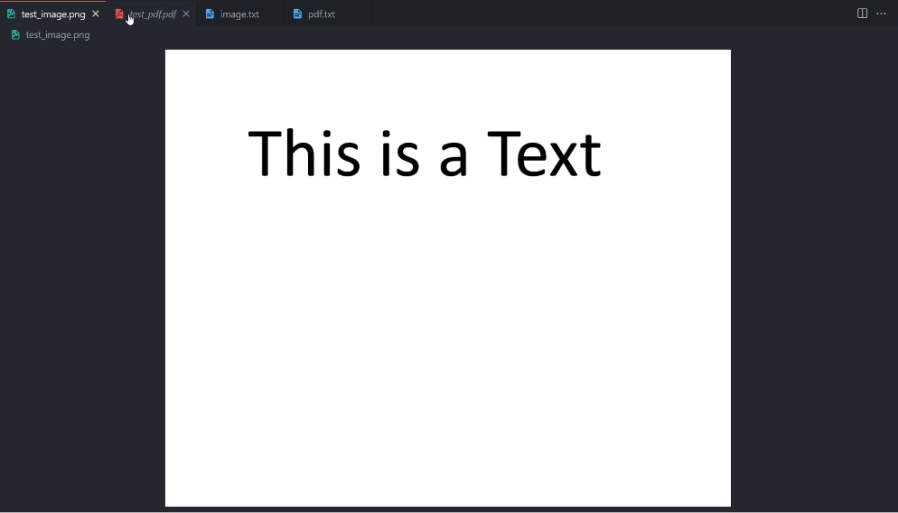

# Text Extraction Tool



This tool allows you to extract text from PDF and image files using OCR (Optical Character Recognition). It supports both PDF and various image formats for text extraction.

## Features

- Extract text from PDF files.
- Extract text from image files (JPG, PNG, etc.).
- Simple command-line interface.

## Requirements

- Python 3.12
- Pip 23.3
- Linux or macOS
## Installation

1. Clone the repository:

    ```bash
    git clone https://github.com/AhmedHanye/TextExtractorPro.git
    ```
2. Install Tesseract from [Tesseract documentation](https://tesseract-ocr.github.io/tessdoc/Installation.html).
3. Install dependencies:

    ```bash
    pip install -r requirements.txt
    ```
4. Install Poppler for handling PDFs:
    ```bash
    # linux:
    sudo apt-get update
    sudo apt-get install poppler-utils
    ```
    ```bash
    # macOS (using Homebrew):
    brew install poppler
    ```
5. Set the path to the Tesseract executable in the script (if not set already) :

    ```python
    pytesseract.pytesseract.tesseract_cmd = '/path/to/your/tesseract'
    ```

## Usage

Run the script from the command line:

```bash
python text_extraction.py
```

## Examples
1. images:
   
    ```
    python TextExtractorPro.py
    Enter the path to File: tests/test_image.png
    Enter the path to the output text file: image.txt
    Enter the File Type (pdf or img): img
    INFO:__main__:Processing page 1 of 1
    ```
2. pdf:
   
   ```
    python TextExtractorPro.py
    Enter the path to File: tests/test_pdf.pdf
    Enter the path to the output text file: pdf.txt
    Enter the File Type (pdf or img): pdf
    INFO:__main__:Total 1 pages found.
    INFO:__main__:Processing page 1 of 1
   ```
   
